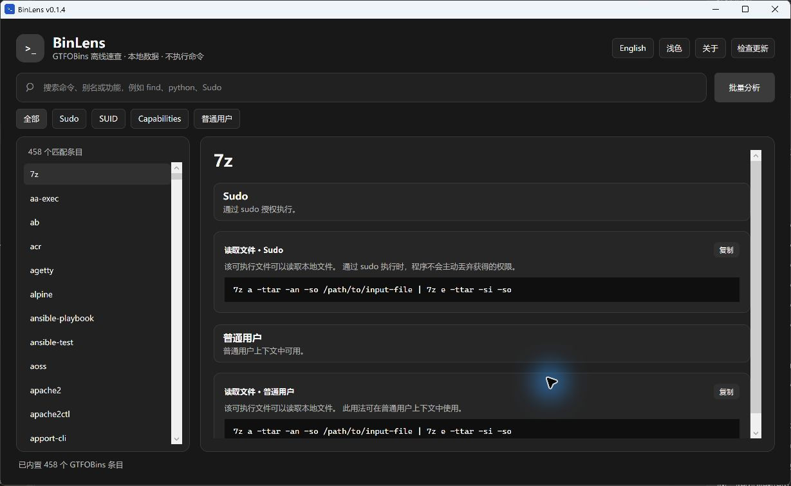

# BinLens

> 面向 Windows 的 GTFOBins 离线速查工具（非官方）

[](LICENSE)




## 它是做什么的？

BinLens 将 [GTFOBins](https://gtfobins.github.io/) 的公开条目内置到一个可双击运行的 Windows 应用中，用于在授权的安全测试、系统审计和学习环境里，快速查询 Linux 二进制程序已公开记录的使用场景。

它还能在本地分析 `sudo -l` 输出，识别其中出现的命令，并与内置条目进行匹配。应用只做检索、展示、复制和文本解析，**不会执行任何命令**。

## 为什么使用 BinLens？

- **完全离线**：日常检索不依赖网络；数据随应用内置，适合断网靶场和内网环境。
- **单文件运行**：下载 `BinLens-win-x64.exe` 后即可双击使用，无需安装 .NET 运行时。
- **分类更清楚**：按 Sudo、SUID、受限 SUID、Capabilities、普通用户等上下文展示，便于快速判断场景。
- **复制更顺手**：点击命令代码区即可复制完整命令；也可拖动选中后使用 `Ctrl+C`。
- **批量分析**：粘贴 `sudo -l` 输出，集中查看精确匹配、版本待确认、未收录与禁止规则。
- **隐私优先**：不收集账号、行为数据或遥测；检索和文本分析均在本地完成。
- **中英与明暗主题**：界面支持中文/English 和浅色/深色切换；命令、路径、参数保持原文。

## 下载与运行

从 [Releases](../../releases/latest) 下载最新的 `BinLens-win-x64.exe`，双击即可运行。每个 Release 都包含对应的 SHA-256 校验文件。

```powershell
Get-FileHash .\BinLens-win-x64.exe -Algorithm SHA256
```

## 快速使用

1. 在搜索框输入二进制名、别名或功能，例如 `find`、`python`、`Sudo`。
2. 使用顶部筛选按钮查看特定上下文，或在详情中直接查看分类区块。
3. 点击任意命令代码区复制完整命令；按 `Ctrl+F` 可随时聚焦搜索。
4. 需要批量核对时，点击“批量分析”，粘贴完整 `sudo -l` 输出。

## 免责声明

- BinLens 是独立的非官方客户端，与 GTFOBins 项目没有隶属或背书关系。
- 本项目仅用于信息查询和本地文本解析；它不执行命令，也不提供任何访问授权。
- 请只在拥有明确授权的系统、靶场或实验环境中使用。使用者应自行遵守适用法律、组织政策与测试范围，并对自身操作负责。
- 内置数据来源于 GTFOBins；数据可能发生变化、存在遗漏或不适用于特定版本与环境，使用前请自行验证。

## 数据、许可证与安全边界

- 数据来源：[GTFOBins/GTFOBins.github.io](https://github.com/GTFOBins/GTFOBins.github.io)
- 本项目采用 [GPL-3.0-only](LICENSE)。上游许可证与署名见 [NOTICE.md](NOTICE.md)。
- 命令、二进制名、路径与参数保持上游原文；中文只用于 BinLens 的界面和说明。
- 安全问题请查看 [SECURITY.md](SECURITY.md)。

## 本地构建

要求：.NET SDK 8。

```powershell
dotnet run --project .\GtfobinsOffline.SelfTest\GtfobinsOffline.SelfTest.csproj -c Release

dotnet publish .\GtfobinsOffline\GtfobinsOffline.csproj `
  -c Release -r win-x64 --self-contained true `
  -p:PublishSingleFile=true -p:IncludeNativeLibrariesForSelfExtract=true `
  -o .\publish
```

推送 `v*` 标签会触发 GitHub Actions：执行自检、构建单文件 EXE、生成 SHA-256，并创建 GitHub Release。

## 贡献

欢迎提交数据同步、翻译、可访问性和界面体验改进。详见 [CONTRIBUTING.md](CONTRIBUTING.md) 与 [CHANGELOG.md](CHANGELOG.md)。
